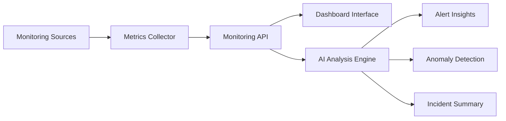

# AI NOC Monitor

AI-powered infrastructure monitoring dashboard designed to help IT teams detect anomalies, analyze metrics, and respond to incidents faster.

---

## Overview

AI NOC Monitor is an experimental open-source project that explores how artificial intelligence can assist in infrastructure monitoring and IT operations.

The system collects monitoring metrics, visualizes them in a dashboard, and uses AI to:

* Detect unusual system behavior
* Summarize alerts and incidents
* Assist operators in troubleshooting
* Improve response time for infrastructure issues

---

## Features

* Real-time monitoring dashboard
* Infrastructure metrics visualization
* AI-powered anomaly detection
* Automated alert summarization
* Event analysis and operational insights

---

## Architecture

The system architecture includes the following components:

Monitoring Sources → Metrics Collector → Monitoring API → Dashboard Interface → AI Analysis Engine

AI models analyze incoming metrics and generate insights for operators.

---

## System Architecture

---

## Use Cases

* Network Operations Center (NOC)
* DevOps monitoring
* Infrastructure anomaly detection
* Alert summarization
* Operational intelligence

---

## Technology Stack

Backend

* Python / Node.js

Frontend

* Web Dashboard

AI Integration

* OpenAI API

Data Sources

* Infrastructure metrics
* System events and alerts

---

## Future Roadmap

* AI incident investigation assistant
* Predictive infrastructure alerts
* Global monitoring event visualization
* Intelligent alert filtering

---

## Contributing

Contributions are welcome. Feel free to submit pull requests or open issues.

---

## License

MIT License
